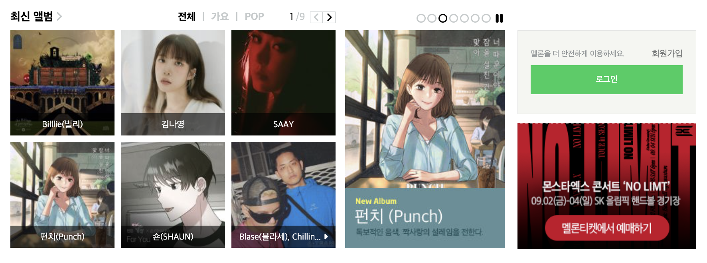

# 🍈 멜론 클론 코딩

 

## **구성 내용 💭**

- `앨범, 이벤트, 로그인 박스`로 나누어 크게는 총 3개의 박스로 구성하였습니다.
- `display: flex 대신 grid를 사용`하였고, 맞지 않는 라인은 적절히 `여백과 이미지 크기를 조절`하여 맞추었습니다.
- 최신 앨범의 가수 이름은 투명한 배경을 맡는 박스와 텍스트를 맡는 박스로 구성하고, `position: absolute` 를 사용였습니다.

 

## **배운 점 💭**

- `구조에 대한 접근과 이해`
- `포지션, 그리드 사용`

 

## **부족한 점 💭**

- 구조를 어떤 식으로 구성할 지 생각하고 접근했음에도 불구하고, 작업을 하면서 계속되는 수정에 `구상이 충분하지 못했다는 걸 느꼈습니다.`
- `이미지 크기를 조절하지 않고, 상-하단 라인을 맞추는 방법`
- `클래스 네임 지정`
- `스타일 속성 선언 순서`
