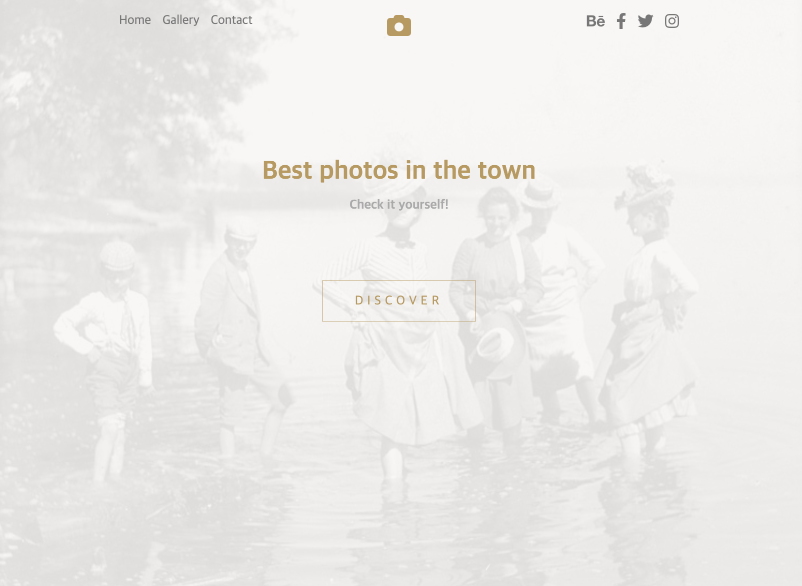
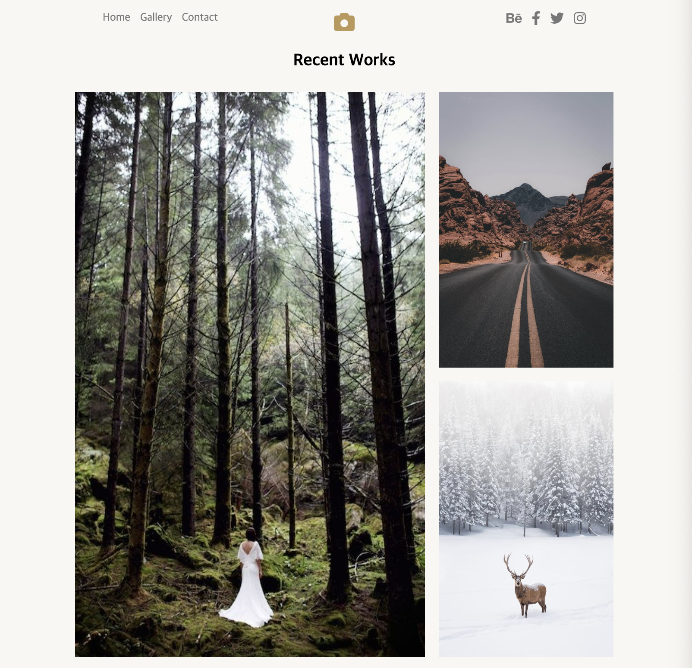
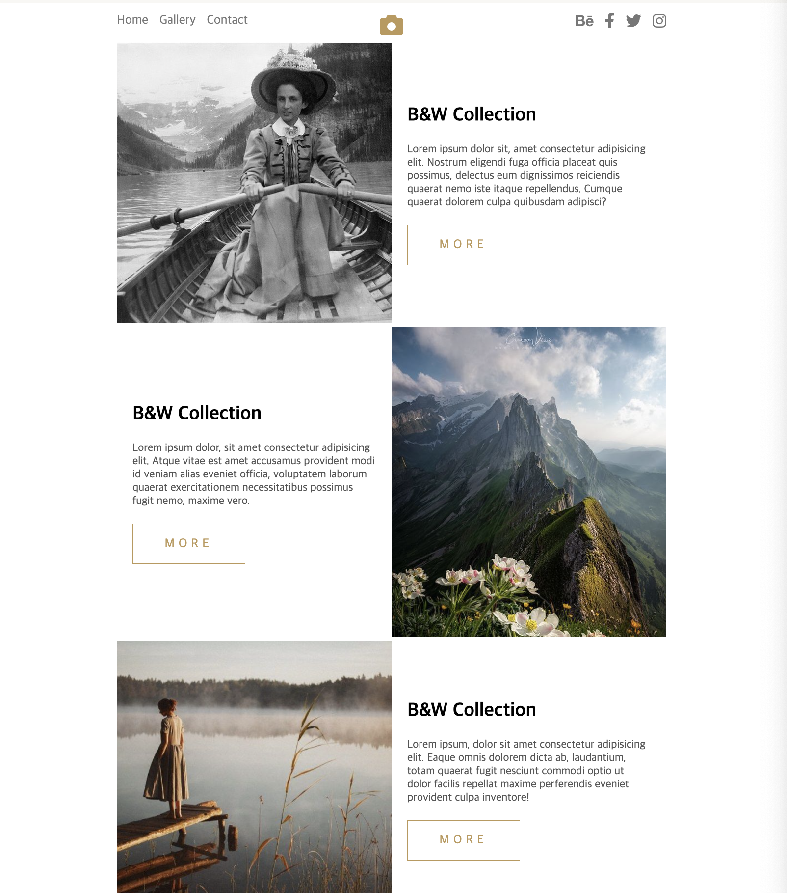
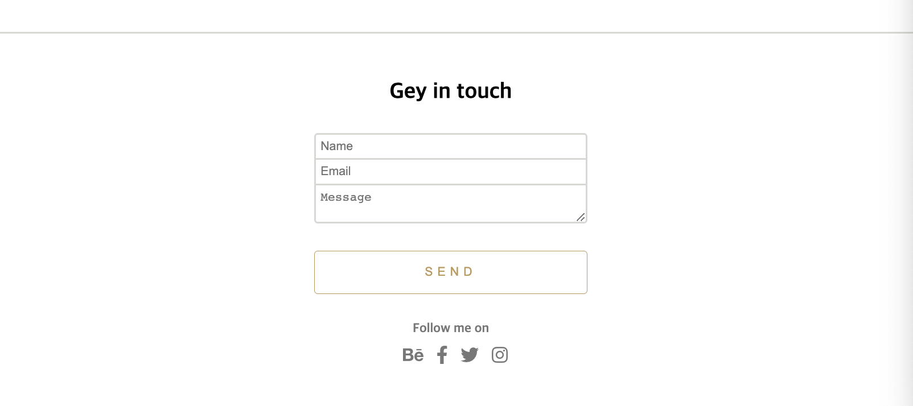
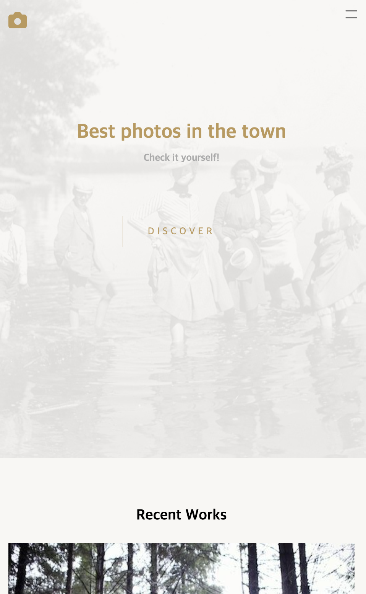
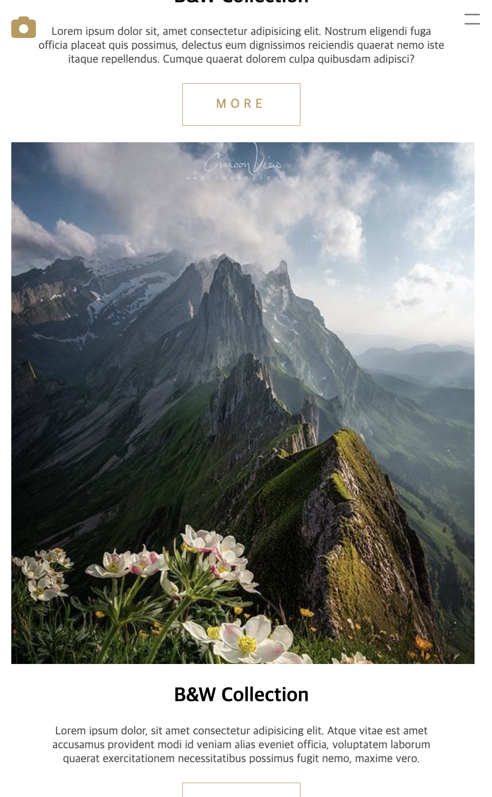

# 📷 포토타운 클론 코딩 📸



## Header

- 왼쪽 상단의 nav 부분과 가운데 로고 그리고 왼쪽 상단의 소셜 부분으로 나눌 때 그리드를 사용한 것이 인상적이있습니다.

## Intro

- 인트로는 크게 문자 내용과 버튼, 백그라운드로 나눌 수 있습니다.
- 백그라운드 이미지는 배경 이미지 위에 흰 배경을 가진 박스를 덮어씌우는 방식입니다.

<br />



## Recent

- 사진들은 위에 3장, 이미지에는 나와있지는 않지만 아래 1장으로 구성되었습니다.
- 위에 3장은 그리드를 사용하기 위해 한 박스 안에 담기게 되고, 아래 한 장은 따로 구성해 가운데 정렬을 하였습니다.

<br />



## Text-blocks

- `이미지와 내용을 담은 하나의 박스`와 `3박스를 모두 담은 커다란 박스`가 존재합니다.
- `각각 박스에게 그리드를 적용`하고, 짝수인 자식에게만 주문을 걸어 사진이 오른쪽에 위치합니다.

```css
.text-block {
  display: grid;
  grid-template-columns: 1fr 1fr;
}
```

<br />



## Footer

- 푸터는 문자와 이름과 이메일, 텍스트를 받는 폼이 있고, 그 아래에 send 버튼과 소셜 버튼으로 구성되었습니다.
- 박스를 만드는 과정은 이미 박스가 생성되어 나오기 때문에, 여백과 테두리를 적절히 사용합니다.

<br />

---



## Mobile Header

- 메뉴바 버튼을 클릭시 네비게이션이 나오는 부분은 CSS로 구성되었고, 더 편한 방법이 있다면 그 방법을 사용하는 것이 바람직해 보입니다.

<br />



- 화면을 줄였을 때 내용물이 밖으로 나오는 이슈가 있었습니다.
- 이를 잡기 위해 화면을 줄였을 떄 `max-width`를 설정하고, 마진을 적절히 사용해 가운데에 위치하도록 하였습니다.
